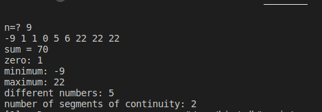

# numbers
Простое консольное приложение, написанное на языке C (Си)

Для введенной пользователем возрастающей последовательности n чисел находит:  
    1 их сумму  
    2 количество введенных нулей  
    3 минимальное и максимальное числа  
    4 количество уникальных чисел  
    5 количество промежутков, состоящих из введенных подряд одинаковых чисел

